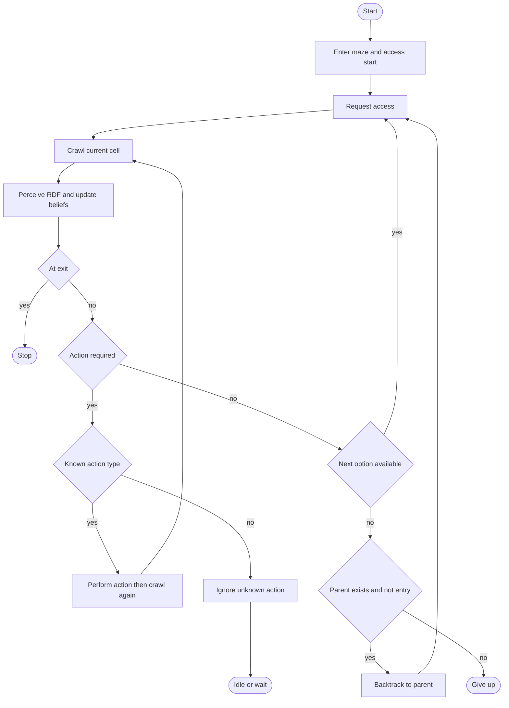
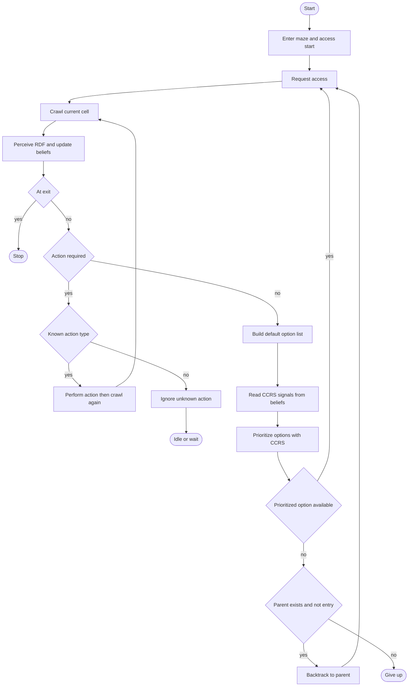
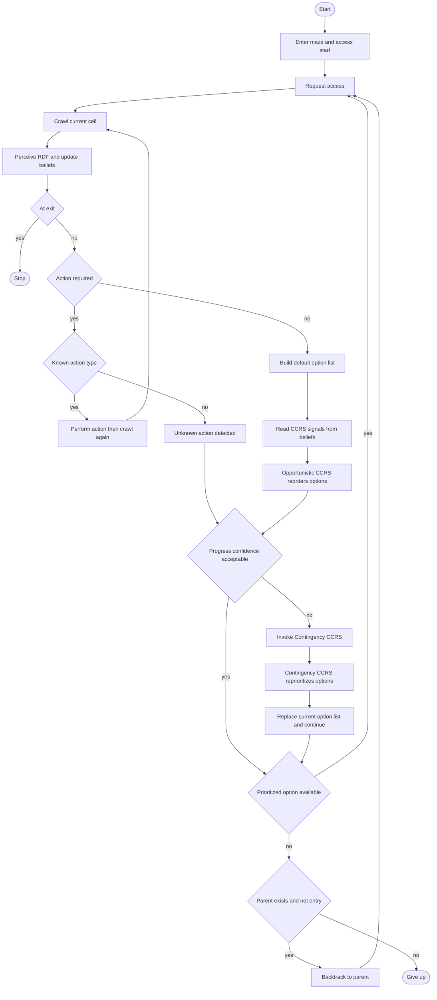
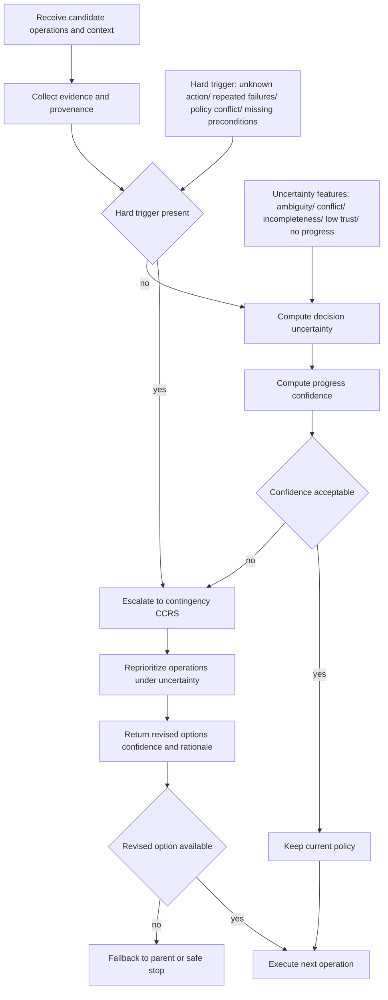

# Depth-First Search (DFS) Flowchart for Maze Navigation

```mermaid
flowchart TD
    A([Start]) --> B[Enter maze and access start]
    B --> C[Request access]
    C --> D[Crawl current cell]
    D --> E[Perceive RDF and update beliefs]
    E --> F{At exit}
    F -- yes --> G([Stop])
    F -- no --> H{Action required}
    H -- yes --> I{Known action type}
    I -- yes --> J[Perform action then crawl again]
    J --> D
    I -- no --> K[Ignore unknown action]
    K --> L([Idle or wait])
    H -- no --> M{Next option available}
    M -- yes --> C
    M -- no --> N{Parent exists and not entry}
    N -- yes --> O[Backtrack to parent]
    O --> C
    N -- no --> P([Give up])
```

# DFS with Opportunistic-CCRS

```mermaid
flowchart TD
    A([Start]) --> B[Enter maze and access start]
    B --> C[Request access]
    C --> D[Crawl current cell]
    D --> E[Perceive RDF and update beliefs]
    E --> F{At exit}
    F -- yes --> G([Stop])
    F -- no --> H{Action required}
    H -- yes --> I{Known action type}
    I -- yes --> J[Perform action then crawl again]
    J --> D
    I -- no --> K[Ignore unknown action]
    K --> L([Idle or wait])
    H -- no --> M[Build default option list]
    M --> N[Read CCRS signals from beliefs]
    N --> O[Prioritize options with CCRS]
    O --> P{Prioritized option available}
    P -- yes --> C
    P -- no --> Q{Parent exists and not entry}
    Q -- yes --> R[Backtrack to parent]
    R --> C
    Q -- no --> S([Give up])
```

# Planned DFS with Opportunistic + Contingency CCRS

```mermaid
flowchart TD
    A([Start]) --> B[Enter maze and access start]
    B --> C[Request access]
    C --> D[Crawl current cell]
    D --> E[Perceive RDF and update beliefs]
    E --> F{At exit}
    F -- yes --> G([Stop])
    F -- no --> H{Action required}
    H -- yes --> I{Known action type}
    I -- yes --> J[Perform action then crawl again]
    J --> D
    I -- no --> K[Unknown action detected]
    K --> P

    H -- no --> M[Build default option list]
    M --> N[Read CCRS signals from beliefs]
    N --> O[Opportunistic CCRS reorders options]
    O --> P{Progress confidence acceptable}

    P -- yes --> Q{Prioritized option available}
    Q -- yes --> C
    Q -- no --> R{Parent exists and not entry}
    R -- yes --> S[Backtrack to parent]
    S --> C
    R -- no --> T([Give up])

    P -- no --> U[Invoke Contingency CCRS]
    U --> V[Contingency CCRS reprioritizes options]
    V --> W[Replace current option list and continue]
    W --> Q
```

# Contingency CCRS Flowchart

```mermaid
flowchart TD
    A[Receive candidate operations and context] --> B[Collect evidence and provenance]
    B --> C{Hard trigger present}

    C -- yes --> D[Escalate to contingency CCRS]
    C -- no --> E[Compute decision uncertainty]
    E --> F[Compute progress confidence]
    F --> G{Confidence acceptable}

    G -- yes --> H[Keep current policy]
    H --> I[Execute next operation]

    G -- no --> D

    D --> J[Reprioritize operations under uncertainty]
    J --> K[Return revised options confidence and rationale]
    K --> L{Revised option available}

    L -- yes --> I
    L -- no --> M[Fallback to parent or safe stop]

    N[Hard trigger: unknown action/ repeated failures/ policy conflict/ missing preconditions] --> C
    O[Uncertainty features: ambiguity/ conflict/ incompleteness/ low trust/ no progress] --> E
```