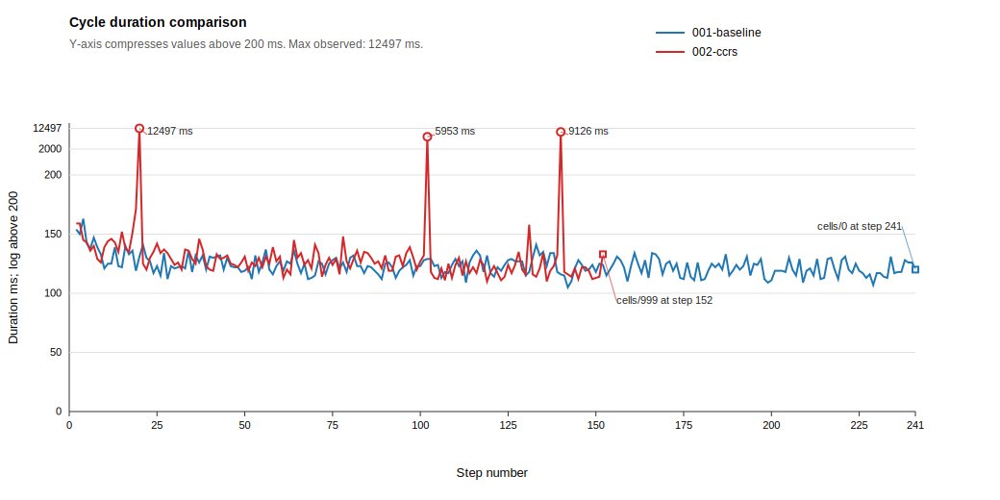
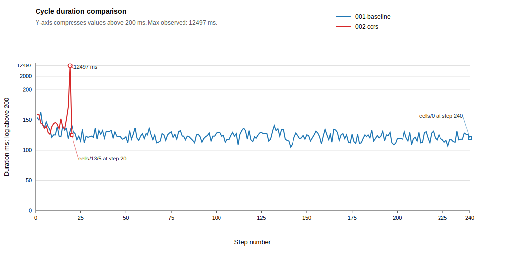
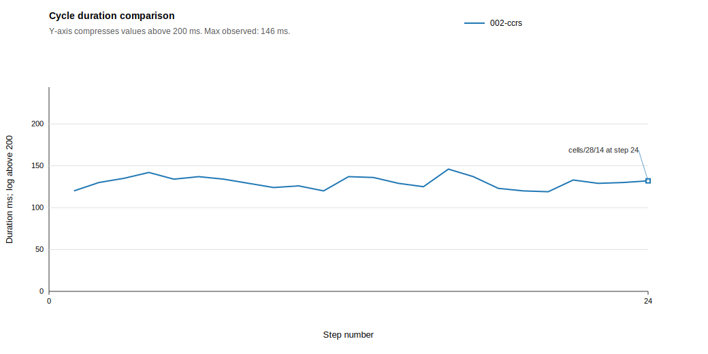
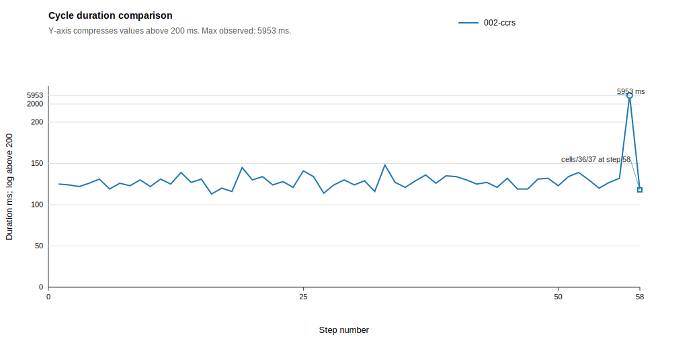
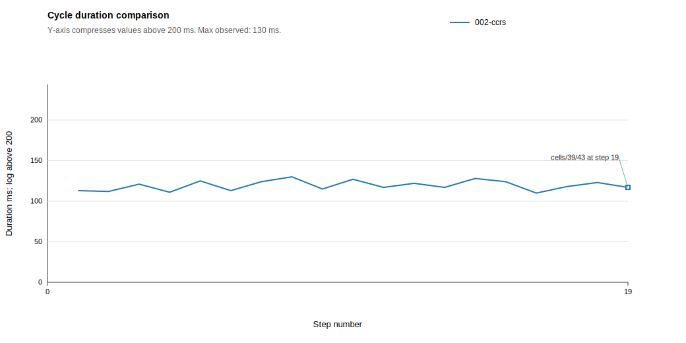
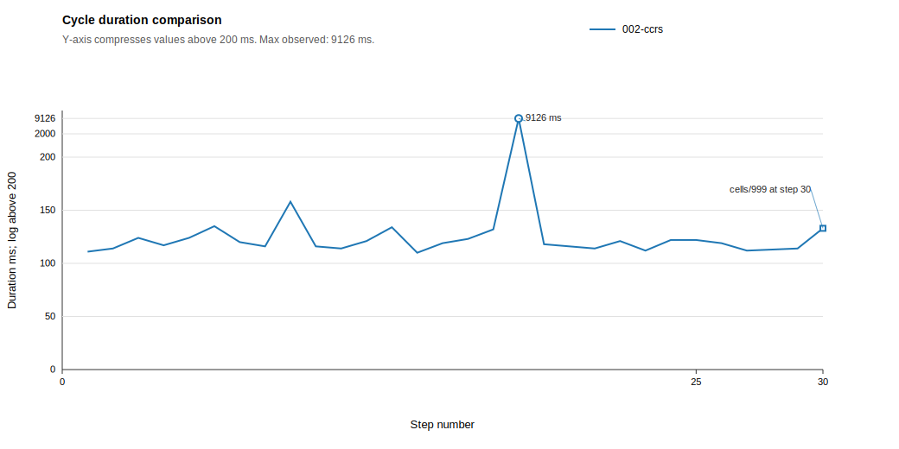

# Experiment Summary: baseline-vs-ccrs-v1

Generated: 2026-06-06 16:52:17 +02:00

Run root: `S:\dev\ma\ccrs-bdi\experiments\runs\baseline-vs-ccrs-v1`

Scenario: CcrsMazeV1

Scenario CcrsMazeV1 contains 3 locked cells. The baseline agent cannot complete the maze because it has no recovery mechanism for lock interactions. This scenario tests whether CCRS enables completion through contingency recovery, and separates normal opportunistic guidance from expensive contingency invocations.

Optimal path length for CcrsMazeV1: 138 moves.

## Core Metrics

| Run | JCM | Reached exit | Total duration ms (source = ASL) | Total moves | Avg agent cycle duration | Final cell |
| --- | --- | --- | ---: | ---: | --- | --- |
| `001-baseline` | `dfs_baseline.jcm` | no | - | 241 | 123.43 | `http://127.0.1.1:8080/cells/0` |
| `002-ccrs` | `dfs_ccrs.jcm` | yes | 46923 | 149 | 307.61 | `http://127.0.1.1:8080/cells/999` |

## Move Optimality

| Run | JCM | Optimal moves | Actual moves | Delta from optimal |
| --- | --- | ---: | ---: | ---: |
| `001-baseline` | `dfs_baseline.jcm` | 138 | 241 | 103 |
| `002-ccrs` | `dfs_ccrs.jcm` | 138 | 149 | 11 |

## Cycle Duration Summary

| Baseline avg ms | CCRS avg ms | CCRS opp 0 avg ms | CCRS opp 1 avg ms | CCRS opp 2 avg ms | CCRS opp 3+ avg ms | CCRS cont invocation 1 avg ms | CCRS cont invocation 2 avg ms | CCRS cont invocation 3 avg ms |
| ---: | ---: | ---: | ---: | ---: | ---: | ---: | ---: | ---: |
| 123.43 | 307.61 | 121.22 | 134.31 | 128.42 | 126 | 12497 | 5953 | 9126 |

Opportunistic CCRS cycle averages exclude cycles where contingency CCRS was active. Contingency columns are dynamically generated ordered invocation cycles, not counts per cycle.

## Cycle Duration Chart

Y-axis compresses values above 200 ms with log-base-100; high-duration outliers are labeled with their actual duration.

## Decision Breakdown

| Run | JCM | Decisions with 2+ directions | Opp-CCRS detected | Opp-CCRS detected rate | Opp-CCRS overruled default | Overruled rate | Decisions with 0-1 directions |
| --- | --- | ---: | ---: | ---: | ---: | ---: | ---: |
| `002-ccrs` | `dfs_ccrs.jcm` | 46 | 38 | 82.6% | 15 | 32.6% | 95 |

## Opportunistic CCRS Overruled Decisions

| CCRS type | Overruled decisions |
| --- | ---: |
| signifier | 4 |
| stigmergy | 11 |

## Contingency CCRS Details

### Invocation 1: `002-ccrs`

| Strategy | Result | Action | Target | Confidence | Eval ms | Opportunistic guidance | No-help reason | Rationale |
| --- | --- | --- | --- | ---: | ---: | --- | --- | --- |
| `prediction_llm` | suggestion | post | `http://127.0.1.1:8080/cells/12/5` | 0.93 | 12232 | False | - | LLM suggests: post to http://127.0.1.1:8080/cells/12/5. Reasoning: The current cell is a locked GreenKey lock exposing an open Hydra POST operation that requires dynmaze:keyValue, and the matching key value greenkey-4852 was observed on a key that fits this lock. |
| `backtrack` | suggestion | navigate | `http://127.0.1.1:8080/cells/11/6` | 0.303397980735908 | 8 | True | - | Blocked at http://127.0.1.1:8080/cells/12/5. Backtracking to checkpoint http://127.0.1.1:8080/cells/11/6 with 1 unexplored alternative(s) (distance: 2 steps) [selected from 6 candidates] |
| `consultation` | none | - | - | - | 0 | False | - | - |
| `retry` | none | - | - | - | 0 | False | - | - |

### Invocation 2: `002-ccrs`

| Strategy | Result | Action | Target | Confidence | Eval ms | Opportunistic guidance | No-help reason | Rationale |
| --- | --- | --- | --- | ---: | ---: | --- | --- | --- |
| `prediction_llm` | suggestion | post | `http://127.0.1.1:8080/cells/36/36` | 0.94 | 5817 | False | - | LLM suggests: post to http://127.0.1.1:8080/cells/36/36. Reasoning: The current cell is a locked RedKey lock with an open Hydra POST operation requiring dynmaze:keyValue, and a matching RedKey value redkey-1670 fitting this lock was observed at http://127.0.1.1:808... |
| `backtrack` | suggestion | navigate | `http://127.0.1.1:8080/cells/35/36` | 0.327725887222398 | 5 | True | - | Blocked at http://127.0.1.1:8080/cells/36/36. Backtracking to checkpoint http://127.0.1.1:8080/cells/35/36 with 1 unexplored alternative(s) (distance: 1 steps) [selected from 34 candidates] |
| `consultation` | none | - | - | - | 1 | False | - | - |
| `retry` | none | - | - | - | 0 | False | - | - |

### Invocation 3: `002-ccrs`

| Strategy | Result | Action | Target | Confidence | Eval ms | Opportunistic guidance | No-help reason | Rationale |
| --- | --- | --- | --- | ---: | ---: | --- | --- | --- |
| `consultation` | suggestion | post | `http://127.0.1.1:8080/cells/44/45` | 0.99 | 677 | False | - | External consultation via a2a (Key Holder Agent (key-holder-agent-1)/provide_blue_key) projected into action: post to http://127.0.1.1:8080/cells/44/45. Projected first literal-valued statement from consultation artifact onto current focus resource. @prefix dyn: &lt;https://paul.ti.rw.fau.de/~am52etar/dynmaze/dynmaze#&gt; .  &lt;http://127.0.1.1:8080/cells/42/41#key&gt; a dyn:BlueKey;     dyn:fitsInLock &lt;h... |
| `backtrack` | suggestion | navigate | `http://127.0.1.1:8080/cells/42/43` | 0.272748443309949 | 3 | True | - | Blocked at http://127.0.1.1:8080/cells/44/45. Backtracking to checkpoint http://127.0.1.1:8080/cells/42/43 with 1 unexplored alternative(s) (distance: 4 steps) |
| `prediction_llm` | no_help | - | - | - | 8308 | False | INSUFFICIENT_CONTEXT | The current resource exposes an open BlueKey unlock POST requiring dynmaze:keyValue, but no observed matching BlueKey value is available in the provided history or neighborhood, so constructing a safe payload would require guessing. |
| `retry` | none | - | - | - | 0 | False | - | - |

## Zone Metrics

Zone metrics mirror the overall report metrics where applicable. Zone optimal move counts are placeholders until the expected values are specified.

### Signifier Zone

Completed when the agent enters `cells/13/5`.

| Run | JCM | Completed | Total duration ms | Total moves | Avg cycle duration | Final cell |
| --- | --- | --- | ---: | ---: | ---: | --- |
| `001-baseline` | `dfs_baseline.jcm` | no | 29624 | 241 | 123.43 | `cells/0` |
| `002-ccrs` | `dfs_ccrs.jcm` | yes | 15213 | 21 | 760.65 | `cells/13/5` |

#### Move Optimality

| Run | Optimal moves | Actual moves | Delta from optimal |
| --- | ---: | ---: | ---: |
| `001-baseline` | 19 | 241 | 222 |
| `002-ccrs` | 19 | 21 | 2 |

#### Cycle Duration Chart

#### Cycle Duration Summary

| Baseline avg ms | CCRS avg ms | CCRS opp 0 avg ms | CCRS opp 1 avg ms | CCRS opp 2 avg ms | CCRS opp 3+ avg ms | CCRS cont invocation 1 avg ms |
| ---: | ---: | ---: | ---: | ---: | ---: | ---: |
| 123.43 | 760.65 | 171 | 141.39 | - | - | 12497 |

#### Decision Breakdown

| Run | JCM | Decisions with 2+ directions | Opp-CCRS detected | Opp-CCRS detected rate | Opp-CCRS overruled default | Overruled rate | Decisions with 0-1 directions |
| --- | --- | ---: | ---: | ---: | ---: | ---: | ---: |
| `002-ccrs` | `dfs_ccrs.jcm` | 7 | 7 | 100.0% | 4 | 57.1% | 12 |

#### Opportunistic CCRS Overruled Decisions

| CCRS type | Overruled decisions |
| --- | ---: |
| signifier | 4 |

### Stigmergy Zone

Completed when the agent enters `cells/28/14`.

| Run | JCM | Completed | Total duration ms | Total moves | Avg cycle duration | Final cell |
| --- | --- | --- | ---: | ---: | ---: | --- |
| `001-baseline` | `dfs_baseline.jcm` | no | - | 0 | - | `-` |
| `002-ccrs` | `dfs_ccrs.jcm` | yes | 3127 | 24 | 130.29 | `cells/28/14` |

#### Move Optimality

| Run | Optimal moves | Actual moves | Delta from optimal |
| --- | ---: | ---: | ---: |
| `001-baseline` | 24 | 0 | -24 |
| `002-ccrs` | 24 | 24 | 0 |

#### Cycle Duration Chart

#### Cycle Duration Summary

| Baseline avg ms | CCRS avg ms | CCRS opp 0 avg ms | CCRS opp 1 avg ms | CCRS opp 2 avg ms | CCRS opp 3+ avg ms |
| ---: | ---: | ---: | ---: | ---: | ---: |
| - | 130.29 | - | 129.94 | 131.14 | - |

#### Decision Breakdown

| Run | JCM | Decisions with 2+ directions | Opp-CCRS detected | Opp-CCRS detected rate | Opp-CCRS overruled default | Overruled rate | Decisions with 0-1 directions |
| --- | --- | ---: | ---: | ---: | ---: | ---: | ---: |
| `002-ccrs` | `dfs_ccrs.jcm` | 8 | 8 | 100.0% | 3 | 37.5% | 16 |

#### Opportunistic CCRS Overruled Decisions

| CCRS type | Overruled decisions |
| --- | ---: |
| stigmergy | 3 |

### Mixed Zone

Completed when the agent enters `cells/36/37`.

| Run | JCM | Completed | Total duration ms | Total moves | Avg cycle duration | Final cell |
| --- | --- | --- | ---: | ---: | ---: | --- |
| `001-baseline` | `dfs_baseline.jcm` | no | - | 0 | - | `-` |
| `002-ccrs` | `dfs_ccrs.jcm` | yes | 13212 | 58 | 227.79 | `cells/36/37` |

#### Move Optimality

| Run | Optimal moves | Actual moves | Delta from optimal |
| --- | ---: | ---: | ---: |
| `001-baseline` | 57 | 0 | -57 |
| `002-ccrs` | 57 | 58 | 1 |

#### Cycle Duration Chart

#### Cycle Duration Summary

| Baseline avg ms | CCRS avg ms | CCRS opp 0 avg ms | CCRS opp 1 avg ms | CCRS opp 2 avg ms | CCRS opp 3+ avg ms | CCRS cont invocation 1 avg ms |
| ---: | ---: | ---: | ---: | ---: | ---: | ---: |
| - | 227.79 | 118 | - | 127.98 | 126 | 5953 |

#### Decision Breakdown

| Run | JCM | Decisions with 2+ directions | Opp-CCRS detected | Opp-CCRS detected rate | Opp-CCRS overruled default | Overruled rate | Decisions with 0-1 directions |
| --- | --- | ---: | ---: | ---: | ---: | ---: | ---: |
| `002-ccrs` | `dfs_ccrs.jcm` | 20 | 20 | 100.0% | 8 | 40.0% | 37 |

#### Opportunistic CCRS Overruled Decisions

| CCRS type | Overruled decisions |
| --- | ---: |
| stigmergy | 8 |

### Construction Site Zone

Completed when the agent enters `cells/39/43`.

| Run | JCM | Completed | Total duration ms | Total moves | Avg cycle duration | Final cell |
| --- | --- | --- | ---: | ---: | ---: | --- |
| `001-baseline` | `dfs_baseline.jcm` | no | - | 0 | - | `-` |
| `002-ccrs` | `dfs_ccrs.jcm` | yes | 2267 | 19 | 119.32 | `cells/39/43` |

#### Move Optimality

| Run | Optimal moves | Actual moves | Delta from optimal |
| --- | ---: | ---: | ---: |
| `001-baseline` | 19 | 0 | -19 |
| `002-ccrs` | 19 | 19 | 0 |

#### Cycle Duration Chart

#### Cycle Duration Summary

| Baseline avg ms | CCRS avg ms | CCRS opp 0 avg ms | CCRS opp 1 avg ms | CCRS opp 2 avg ms | CCRS opp 3+ avg ms |
| ---: | ---: | ---: | ---: | ---: | ---: |
| - | 119.32 | 118.87 | 121 | - | - |

#### Decision Breakdown

| Run | JCM | Decisions with 2+ directions | Opp-CCRS detected | Opp-CCRS detected rate | Opp-CCRS overruled default | Overruled rate | Decisions with 0-1 directions |
| --- | --- | ---: | ---: | ---: | ---: | ---: | ---: |
| `002-ccrs` | `dfs_ccrs.jcm` | 5 | 3 | 60.0% | 0 | 0.0% | 14 |

#### Opportunistic CCRS Overruled Decisions

No opportunistic CCRS overruled decisions in this zone.

### Social Zone

Completed when the agent enters `cells/999`.

| Run | JCM | Completed | Total duration ms | Total moves | Avg cycle duration | Final cell |
| --- | --- | --- | ---: | ---: | ---: | --- |
| `001-baseline` | `dfs_baseline.jcm` | no | - | 0 | - | `-` |
| `002-ccrs` | `dfs_ccrs.jcm` | yes | 12630 | 30 | 421 | `cells/999` |

#### Move Optimality

| Run | Optimal moves | Actual moves | Delta from optimal |
| --- | ---: | ---: | ---: |
| `001-baseline` | 19 | 0 | -19 |
| `002-ccrs` | 19 | 30 | 11 |

#### Cycle Duration Chart

#### Cycle Duration Summary

| Baseline avg ms | CCRS avg ms | CCRS opp 0 avg ms | CCRS opp 1 avg ms | CCRS opp 2 avg ms | CCRS opp 3+ avg ms | CCRS cont invocation 1 avg ms |
| ---: | ---: | ---: | ---: | ---: | ---: | ---: |
| - | 421 | 120.83 | - | - | - | 9126 |

#### Decision Breakdown

| Run | JCM | Decisions with 2+ directions | Opp-CCRS detected | Opp-CCRS detected rate | Opp-CCRS overruled default | Overruled rate | Decisions with 0-1 directions |
| --- | --- | ---: | ---: | ---: | ---: | ---: | ---: |
| `002-ccrs` | `dfs_ccrs.jcm` | 6 | 0 | 0.0% | 0 | 0.0% | 16 |

#### Opportunistic CCRS Overruled Decisions

No opportunistic CCRS overruled decisions in this zone.

## Generated Artifacts

- `runs.csv`: one row per run with outcome and aggregate metrics.
- `decisions.csv`: one row per parsed prioritization decision.
- `contingency.csv`: structured and fallback contingency events.
- `actions.csv`: parsed movement and action events.
- `mase-events.csv`: filtered MASE `AGENT_MOVED` and `TRANSACTION` event records.
- `mase-agent-moved.csv`: MASE movement events normalized for route analysis.
- `mase-transactions.csv`: MASE transaction events normalized for action/server-side analysis.
- `agents.csv`: one row per observed agent per run with movement and transaction totals.
- `cycle-durations.csv`: one row per structured agent cycle marker with derived cycle duration and CCRS event counts.
- `cycle-duration-comparison.svg`: SVG line chart comparing cycle duration by step.
- `zone-summary.csv`: one row per run-zone pair with zone completion, movement, cycle, and decision metrics.
- `zone-cycle-duration-signifier.svg`: SVG line chart comparing cycle duration inside the Signifier Zone.
- `zone-cycle-duration-stigmergy.svg`: SVG line chart comparing cycle duration inside the Stigmergy Zone.
- `zone-cycle-duration-mixed.svg`: SVG line chart comparing cycle duration inside the Mixed Zone.
- `zone-cycle-duration-construction-site.svg`: SVG line chart comparing cycle duration inside the Construction Site Zone.
- `zone-cycle-duration-social.svg`: SVG line chart comparing cycle duration inside the Social Zone.
- `path-analysis-inputs/*.cells.txt`: copy-paste cell sequences for the MASE viewer Path Analysis overlay.
- `path-analysis-inputs.csv`: index of generated Path Analysis copy-paste files.
- `summary.json`: parser metadata.
