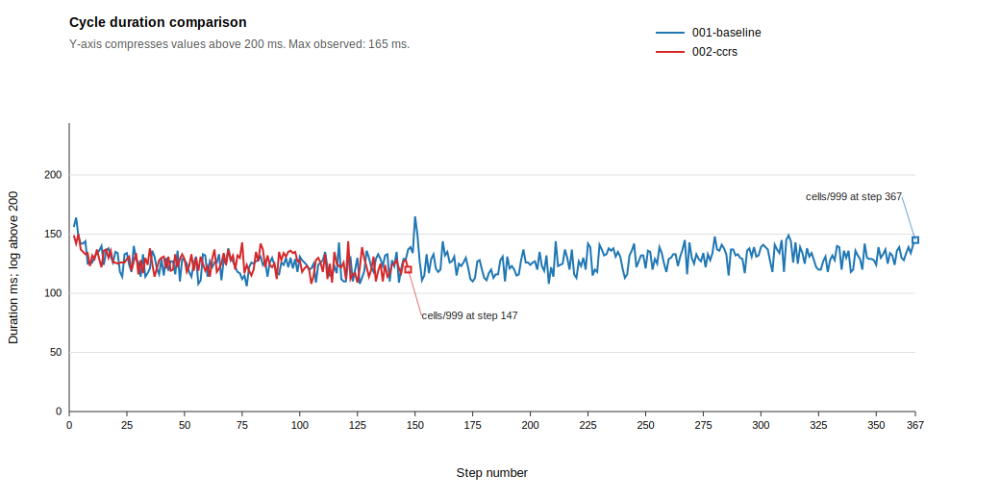
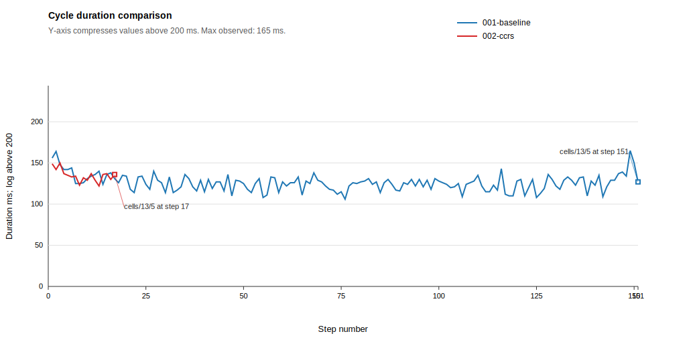
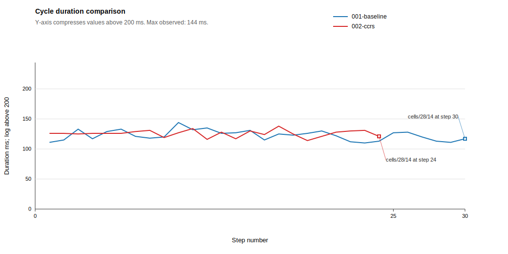
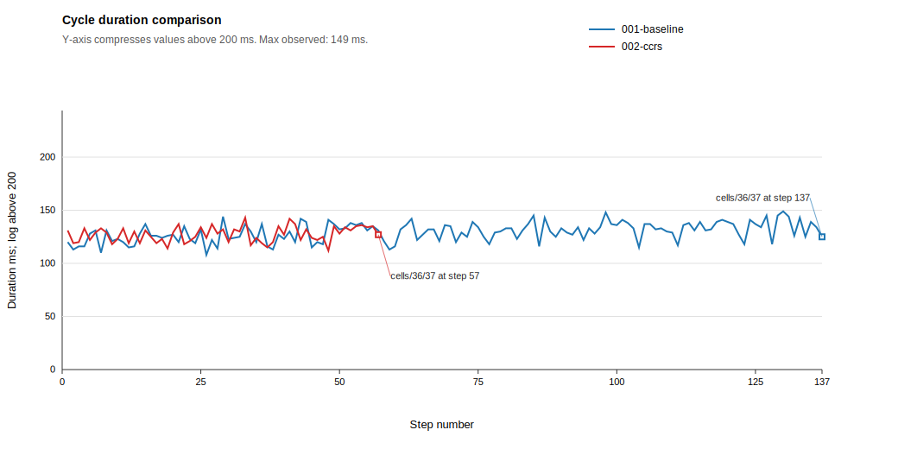
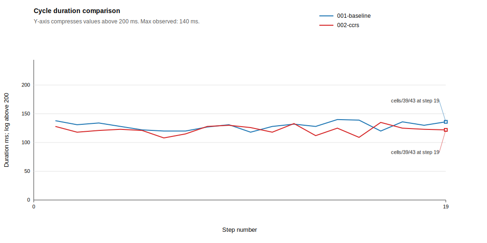
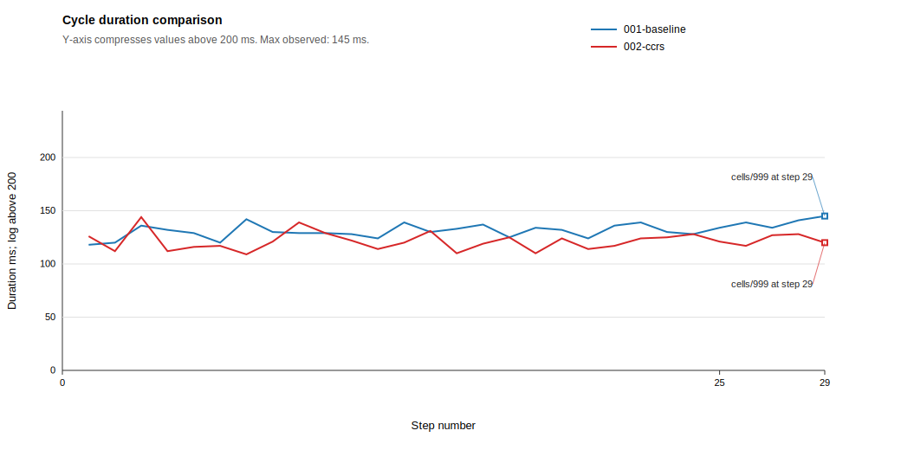

# Experiment Summary: baseline-vs-ccrs-v2

Generated: 2026-06-06 16:52:19 +02:00

Run root: `S:\dev\ma\ccrs-bdi\experiments\runs\baseline-vs-ccrs-v2`

Scenario: CcrsMazeV2

Scenario CcrsMazeV2 contains no locked cells. It is the baseline traversal scenario: both agents can reach the exit without contingency recovery, so the comparison focuses on path efficiency, opportunistic CCRS influence, movement count, and normal cycle-time overhead.

Optimal path length for CcrsMazeV2: 116 moves.

## Core Metrics

| Run | JCM | Reached exit | Total duration ms (source = ASL) | Total moves | Avg agent cycle duration | Final cell |
| --- | --- | --- | ---: | ---: | --- | --- |
| `001-baseline` | `dfs_baseline.jcm` | yes | 47510 | 367 | 127.6 | `http://127.0.1.1:8080/cells/999` |
| `002-ccrs` | `dfs_ccrs.jcm` | yes | 18860 | 147 | 126.01 | `http://127.0.1.1:8080/cells/999` |

## Move Optimality

| Run | JCM | Optimal moves | Actual moves | Delta from optimal |
| --- | --- | ---: | ---: | ---: |
| `001-baseline` | `dfs_baseline.jcm` | 116 | 367 | 251 |
| `002-ccrs` | `dfs_ccrs.jcm` | 116 | 147 | 31 |

## Cycle Duration Summary

| Baseline avg ms | CCRS avg ms | CCRS opp 0 avg ms | CCRS opp 1 avg ms | CCRS opp 2 avg ms | CCRS opp 3+ avg ms |
| ---: | ---: | ---: | ---: | ---: | ---: |
| 127.6 | 126.01 | 122.11 | 129.47 | 126.16 | 128.64 |

Opportunistic CCRS cycle averages exclude cycles where contingency CCRS was active.

## Cycle Duration Chart

Y-axis compresses values above 200 ms with log-base-100; high-duration outliers are labeled with their actual duration.

## Decision Breakdown

| Run | JCM | Decisions with 2+ directions | Opp-CCRS detected | Opp-CCRS detected rate | Opp-CCRS overruled default | Overruled rate | Decisions with 0-1 directions |
| --- | --- | ---: | ---: | ---: | ---: | ---: | ---: |
| `002-ccrs` | `dfs_ccrs.jcm` | 46 | 38 | 82.6% | 15 | 32.6% | 93 |

## Opportunistic CCRS Overruled Decisions

| CCRS type | Overruled decisions |
| --- | ---: |
| signifier | 4 |
| stigmergy | 11 |

## Zone Metrics

Zone metrics mirror the overall report metrics where applicable. Zone optimal move counts are placeholders until the expected values are specified.

### Signifier Zone

Completed when the agent enters `cells/13/5`.

| Run | JCM | Completed | Total duration ms | Total moves | Avg cycle duration | Final cell |
| --- | --- | --- | ---: | ---: | ---: | --- |
| `001-baseline` | `dfs_baseline.jcm` | yes | 19015 | 152 | 125.93 | `cells/13/5` |
| `002-ccrs` | `dfs_ccrs.jcm` | yes | 2291 | 18 | 134.76 | `cells/13/5` |

#### Move Optimality

| Run | Optimal moves | Actual moves | Delta from optimal |
| --- | ---: | ---: | ---: |
| `001-baseline` | 17 | 152 | 135 |
| `002-ccrs` | 17 | 18 | 1 |

#### Cycle Duration Chart

#### Cycle Duration Summary

| Baseline avg ms | CCRS avg ms | CCRS opp 0 avg ms | CCRS opp 1 avg ms | CCRS opp 2 avg ms | CCRS opp 3+ avg ms |
| ---: | ---: | ---: | ---: | ---: | ---: |
| 125.93 | 134.76 | - | 134.76 | - | - |

#### Decision Breakdown

| Run | JCM | Decisions with 2+ directions | Opp-CCRS detected | Opp-CCRS detected rate | Opp-CCRS overruled default | Overruled rate | Decisions with 0-1 directions |
| --- | --- | ---: | ---: | ---: | ---: | ---: | ---: |
| `002-ccrs` | `dfs_ccrs.jcm` | 7 | 7 | 100.0% | 4 | 57.1% | 10 |

#### Opportunistic CCRS Overruled Decisions

| CCRS type | Overruled decisions |
| --- | ---: |
| signifier | 4 |

### Stigmergy Zone

Completed when the agent enters `cells/28/14`.

| Run | JCM | Completed | Total duration ms | Total moves | Avg cycle duration | Final cell |
| --- | --- | --- | ---: | ---: | ---: | --- |
| `001-baseline` | `dfs_baseline.jcm` | yes | 3684 | 30 | 122.8 | `cells/28/14` |
| `002-ccrs` | `dfs_ccrs.jcm` | yes | 3018 | 24 | 125.75 | `cells/28/14` |

#### Move Optimality

| Run | Optimal moves | Actual moves | Delta from optimal |
| --- | ---: | ---: | ---: |
| `001-baseline` | 24 | 30 | 6 |
| `002-ccrs` | 24 | 24 | 0 |

#### Cycle Duration Chart

#### Cycle Duration Summary

| Baseline avg ms | CCRS avg ms | CCRS opp 0 avg ms | CCRS opp 1 avg ms | CCRS opp 2 avg ms | CCRS opp 3+ avg ms |
| ---: | ---: | ---: | ---: | ---: | ---: |
| 122.8 | 125.75 | - | 126.82 | 123.14 | - |

#### Decision Breakdown

| Run | JCM | Decisions with 2+ directions | Opp-CCRS detected | Opp-CCRS detected rate | Opp-CCRS overruled default | Overruled rate | Decisions with 0-1 directions |
| --- | --- | ---: | ---: | ---: | ---: | ---: | ---: |
| `002-ccrs` | `dfs_ccrs.jcm` | 8 | 8 | 100.0% | 3 | 37.5% | 16 |

#### Opportunistic CCRS Overruled Decisions

| CCRS type | Overruled decisions |
| --- | ---: |
| stigmergy | 3 |

### Mixed Zone

Completed when the agent enters `cells/36/37`.

| Run | JCM | Completed | Total duration ms | Total moves | Avg cycle duration | Final cell |
| --- | --- | --- | ---: | ---: | ---: | --- |
| `001-baseline` | `dfs_baseline.jcm` | yes | 17728 | 137 | 129.4 | `cells/36/37` |
| `002-ccrs` | `dfs_ccrs.jcm` | yes | 7248 | 57 | 127.16 | `cells/36/37` |

#### Move Optimality

| Run | Optimal moves | Actual moves | Delta from optimal |
| --- | ---: | ---: | ---: |
| `001-baseline` | 37 | 137 | 100 |
| `002-ccrs` | 37 | 57 | 20 |

#### Cycle Duration Chart

#### Cycle Duration Summary

| Baseline avg ms | CCRS avg ms | CCRS opp 0 avg ms | CCRS opp 1 avg ms | CCRS opp 2 avg ms | CCRS opp 3+ avg ms |
| ---: | ---: | ---: | ---: | ---: | ---: |
| 129.4 | 127.16 | 127 | - | 126.67 | 128.64 |

#### Decision Breakdown

| Run | JCM | Decisions with 2+ directions | Opp-CCRS detected | Opp-CCRS detected rate | Opp-CCRS overruled default | Overruled rate | Decisions with 0-1 directions |
| --- | --- | ---: | ---: | ---: | ---: | ---: | ---: |
| `002-ccrs` | `dfs_ccrs.jcm` | 20 | 20 | 100.0% | 8 | 40.0% | 37 |

#### Opportunistic CCRS Overruled Decisions

| CCRS type | Overruled decisions |
| --- | ---: |
| stigmergy | 8 |

### Construction Site Zone

Completed when the agent enters `cells/39/43`.

| Run | JCM | Completed | Total duration ms | Total moves | Avg cycle duration | Final cell |
| --- | --- | --- | ---: | ---: | ---: | --- |
| `001-baseline` | `dfs_baseline.jcm` | yes | 2458 | 19 | 129.37 | `cells/39/43` |
| `002-ccrs` | `dfs_ccrs.jcm` | yes | 2320 | 19 | 122.11 | `cells/39/43` |

#### Move Optimality

| Run | Optimal moves | Actual moves | Delta from optimal |
| --- | ---: | ---: | ---: |
| `001-baseline` | 19 | 19 | 0 |
| `002-ccrs` | 19 | 19 | 0 |

#### Cycle Duration Chart

#### Cycle Duration Summary

| Baseline avg ms | CCRS avg ms | CCRS opp 0 avg ms | CCRS opp 1 avg ms | CCRS opp 2 avg ms | CCRS opp 3+ avg ms |
| ---: | ---: | ---: | ---: | ---: | ---: |
| 129.37 | 122.11 | 123.13 | 118.25 | - | - |

#### Decision Breakdown

| Run | JCM | Decisions with 2+ directions | Opp-CCRS detected | Opp-CCRS detected rate | Opp-CCRS overruled default | Overruled rate | Decisions with 0-1 directions |
| --- | --- | ---: | ---: | ---: | ---: | ---: | ---: |
| `002-ccrs` | `dfs_ccrs.jcm` | 5 | 3 | 60.0% | 0 | 0.0% | 14 |

#### Opportunistic CCRS Overruled Decisions

No opportunistic CCRS overruled decisions in this zone.

### Social Zone

Completed when the agent enters `cells/999`.

| Run | JCM | Completed | Total duration ms | Total moves | Avg cycle duration | Final cell |
| --- | --- | --- | ---: | ---: | ---: | --- |
| `001-baseline` | `dfs_baseline.jcm` | yes | 3817 | 29 | 131.62 | `cells/999` |
| `002-ccrs` | `dfs_ccrs.jcm` | yes | 3521 | 29 | 121.41 | `cells/999` |

#### Move Optimality

| Run | Optimal moves | Actual moves | Delta from optimal |
| --- | ---: | ---: | ---: |
| `001-baseline` | 19 | 29 | 10 |
| `002-ccrs` | 19 | 29 | 10 |

#### Cycle Duration Chart

#### Cycle Duration Summary

| Baseline avg ms | CCRS avg ms | CCRS opp 0 avg ms | CCRS opp 1 avg ms | CCRS opp 2 avg ms | CCRS opp 3+ avg ms |
| ---: | ---: | ---: | ---: | ---: | ---: |
| 131.62 | 121.41 | 121.41 | - | - | - |

#### Decision Breakdown

| Run | JCM | Decisions with 2+ directions | Opp-CCRS detected | Opp-CCRS detected rate | Opp-CCRS overruled default | Overruled rate | Decisions with 0-1 directions |
| --- | --- | ---: | ---: | ---: | ---: | ---: | ---: |
| `002-ccrs` | `dfs_ccrs.jcm` | 6 | 0 | 0.0% | 0 | 0.0% | 16 |

#### Opportunistic CCRS Overruled Decisions

No opportunistic CCRS overruled decisions in this zone.

## Generated Artifacts

- `runs.csv`: one row per run with outcome and aggregate metrics.
- `decisions.csv`: one row per parsed prioritization decision.
- `contingency.csv`: structured and fallback contingency events.
- `actions.csv`: parsed movement and action events.
- `mase-events.csv`: filtered MASE `AGENT_MOVED` and `TRANSACTION` event records.
- `mase-agent-moved.csv`: MASE movement events normalized for route analysis.
- `mase-transactions.csv`: MASE transaction events normalized for action/server-side analysis.
- `agents.csv`: one row per observed agent per run with movement and transaction totals.
- `cycle-durations.csv`: one row per structured agent cycle marker with derived cycle duration and CCRS event counts.
- `cycle-duration-comparison.svg`: SVG line chart comparing cycle duration by step.
- `zone-summary.csv`: one row per run-zone pair with zone completion, movement, cycle, and decision metrics.
- `zone-cycle-duration-signifier.svg`: SVG line chart comparing cycle duration inside the Signifier Zone.
- `zone-cycle-duration-stigmergy.svg`: SVG line chart comparing cycle duration inside the Stigmergy Zone.
- `zone-cycle-duration-mixed.svg`: SVG line chart comparing cycle duration inside the Mixed Zone.
- `zone-cycle-duration-construction-site.svg`: SVG line chart comparing cycle duration inside the Construction Site Zone.
- `zone-cycle-duration-social.svg`: SVG line chart comparing cycle duration inside the Social Zone.
- `path-analysis-inputs/*.cells.txt`: copy-paste cell sequences for the MASE viewer Path Analysis overlay.
- `path-analysis-inputs.csv`: index of generated Path Analysis copy-paste files.
- `summary.json`: parser metadata.
